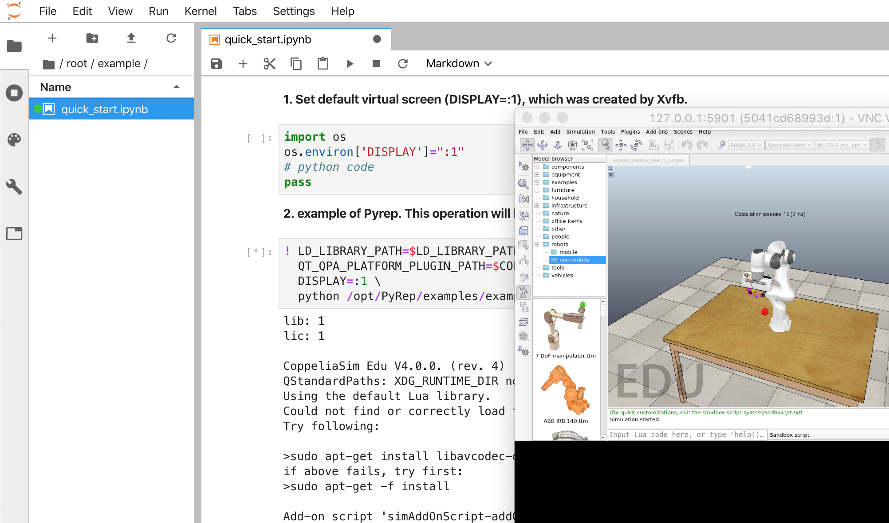
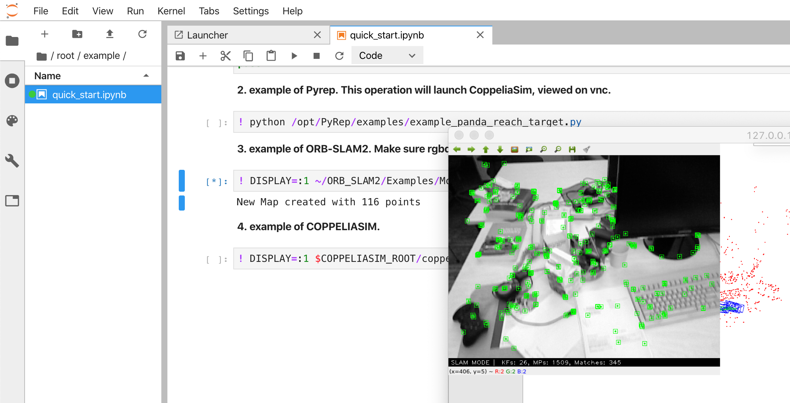

## How to build a pure environment for SLAM and ML/DL/RL.

### 1. install and launch [Docker](www.docker.com), obviously.

### 2. clone this repo and execute the script `build.sh`.

```shell
git clone --recursive https://github.com/Cenbylin/ML-SLAM-env.git
cd ML-SLAM-env/
chmod +x build.sh
./build.sh
```

### 3. launch the environment in a Docker container.

```shell
docker run -it --rm -p 5901:5900 -p 18888:8888 ml-slam-env
```

### 4. use jupyter lab on your browser

access URL [http://127.0.0.1:18888](http://127.0.0.1:18888)

### 5. use vnc client to view the virtual screen (enable GUI application)

`vnc server:127.0.0.1:5901` 

`password:1234` 

## Example and Data

`quick_start.ipynb` is existing in `/root/example`

------



------



------

#### data: come back soon